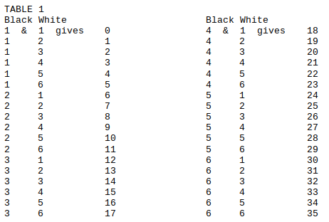
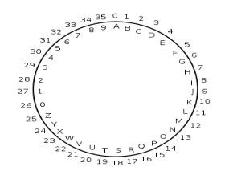
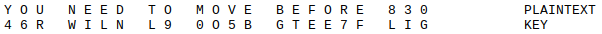
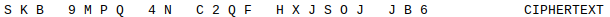
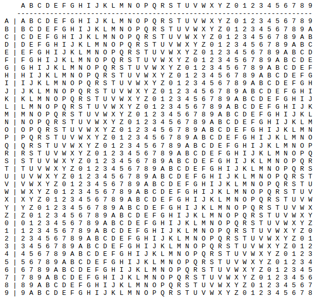

# UNBREAKABLE ENCRYPTION WITH ONE-TIME PADS 
## A VERY SHORT SOMEWHAT OPINIONATED GUIDE  
Licensed under CC0 1.0 Universal. This document is public domain.

Use at your own risk. You should find someone who knows what they're doing to confirm this guide's accuracy. No one is liable for anything bad that happens to you because you followed this guide.

## Background and Opining

A one-time pad is a technique used to encrypt a message so that the encryption is unbreakable if it's implemented correctly. If you’re unconvinced see Claude Shannon’s proof in “Communication Theory of Secrecy Systems” from 1949. OTPs provide no information about the original message to an attacker except perhaps its maximum possible length. They would even be resistant to cryptanalysis performed by quantum computers if humans could ever succeed at building useful ones.

The first known OTP was created by Frank Miller in 1882 for use in telegrams but was soon forgotten. In 1917 Gilbert Vernon independently developed an OTP and made the technique popular at AT&T. OTPs have a rich history---they've been used by everyone from the NSA to the KGB and now you will be able to commit espionage and topple regimes with the best of them.

OTPs are not panaceas. Instead they’re best considered one tool among many because they do have their drawbacks. For one thing, generating a large quantity of truly random numbers is nontrivial. Your keys must be at least as long as the messages themselves and you must transmit the keys over secure channels. You also need to destroy the used keys and random numbers immediately after decrypting messages.

Today's crypto algorithms on our digital devices eliminate these problems but introduce their own issues. Modern encryption usually relies on solving what are believed to be very difficult mathematical problems involving elliptic curves, discrete logarithms, or integer factorization. These problems are difficult because of the massive amounts of computing power and time required to solve them. While we do have algorithms that would be resistant to quantum computers, most of our current privileged data could be revealed if the technology ever succeeds. We also occasionally find vulnerabilities in the encryption algorithms and implementations that we rely on so heavily.

Even with well designed and implemented algorithms, modern crypto lives on computers that we can't trust to respect us. We have pretty good libre software options but we're usually forced to use closed source, proprietary hardware that no one can audit. Even if we could inspect our hardware in theory isn't it too complicated for all but the engineers who designed it? And aren't there too many points of potential compromise in any given supply chain? We could say the same thing about software though really. The Linux kernel? Enormous. All the binaries we download? We're a long way from reproducibility being the norm. Since there's no way to acheive absolute security, whatever that is, thinking in terms of threat models is more helpful. *Do I only really need to worry about script kiddies who just found Kali Linux or do I need to stay safe from three-letter nation state agencies because my life is in danger?* That's not to say we shouldn't always do our best and avoid obvious malfeasance. If we treat unknowns as malicious and keep in mind the great lengths that governments and corporations go to prevent us from having privacy then a tool like the one time pad might still prove useful today. 

Also important to note: know the laws concerning cryptography for your country and the countries you visit, especially when crossing borders. Count on state actors not following their own rules and remember that in reality a $5 wrench can usually break any crypto!   

  
  
Consider steganography to hide the fact that you’re carrying secret messages!

## Absolutely Do not Forget or You Will Be Killed

To make a perfect OTP, you must adhere to the following principles. Again, it is absolutely imperative or you will not have unbreakable encryption.

1)  Each key must be truly randomly generated. Do not use software to generate keys. The deterministic nature of software will only generate pseudo-random numbers that a sophisticated attacker could reproduce and use to break the encryption.

2)  The key must be at least as long as the message.

3)  Senders and receivers must never reuse keys and they must destroy the keys, random numbers, and messages immediately after sending/decrypting.

## Make the Thing

### 1.) Randomly Generate Your Keys 
Use 2 regular 6-sided dice but never ever ever simply add the 2 values together for your numbers because certain values will statistically occur far more often than others and you will introduce bias into things. It’s crucial to make sure each value has the same probability of occurring as any other value. Since we're encrypting both letters and numbers in this example, you will need to assign 36 values starting with 0 to each number/color combination of dice as shown below. If you roll a black 5 and a white 1 for example, you will end up with the random number 24.  

Let's say we end up with the following random numbers: 

2, 16, 3, 2, 5, 30, 32, 17, 22, 8, 11, 13, 11, 35, 26, 14, 31, 1, 6, 19, 4, 4, 33, 5, 11, 8, 6

We'll assign these numbers values between A through Z and 0 through 9 as shown in TABLE 2 below. Starting at 0 will ensure you don't run into problems with modular arithmetic which we'll get to in a sec. 

TABLE 2  

By assigning letters and numbers to the string of random numbers from our dice rolls, we get the following encryption key:

C Q D C F&nbsp;&nbsp;&nbsp;&nbsp;&nbsp;4 6 R W I L N L 9 0 O 5 B G T E E 7 F L I G

This will work for a short message. What if we want to send something much longer? Things can get tedious pretty quickly. Maybe there are more efficient ways to generate random numbers (no, I'm absolutely not talking about software!). Can we trust these methods? Better not trust anything. Let's just stick to dice for now.

### 2.) Exchange Randomly Generated Keys 
Share your keys ahead of time with the recipient over some secure channel (probably a face to face meeting). These keys will be used to encrypt and decrypt the messages you'll exchange after your meeting.

### 3.) Agree on Some Conditions 
Agree on a few conditions ahead of time so there's no confusion encrypting and decrypting:

1.) In this example agree that messages can contain both letters and numbers.

2.) Each of these letters and numbers will correspond to values 0 through 35 beginning with A at 0 and 9 at 35 (see TABLE 2). 

3.) Use modular addition to encrypt and modular subtraction to decrypt as explained below instead of the other way around.
  
Obviously there's some leeway here in how you can choose to do things as long as you heed the warnings above. Randomly generated secret keys and modular arithmetic are necessary to ensure the OTP is unbreakable.  

### 4.) Encrypt Your Message
If we have a really long stream of random letters and numbers for our key, it's a good idea to start our message with some characters from the key itself so the recipient will know where where in the key they should start decrypting. Let's use the first five characters we generated (although in a longer example you might want to use a longer sequence to reduce the likelihood that there are identical sequences in the key somewhere, however unlikely).

Our first five values were CQDCF. If I'm receiving this message from you, I'll find those sequences in my key and then start with the first character after that to decrypt.

Let's say you want to send the message "YOU NEED TO MOVE BEFORE 830" to your recipient. Write out the plaintext and the key below it for convenience:

  

To encrypt the message and generate the ciphertext (the encrypted message that’s safe to send over any insecure channel), we'll use modular addition which reveals nothing about the values added together. Think of modular addition like you would think of moving around a clock: if we start at 9pm, adding 8 hours puts us at 5am. With this OTP of letters and numbers, we need to use modulo 36 as if we had a 36 hour clock starting at 0 (0-35). If we were only encrypting digits, we would use modulo 10. If we were only encrypting English letters we would use modulo 26 and so on.

The modular addition process goes like this: start with “Y” in the plaintext which corresponds to the value 24 in TABLE 2. Look up the first character in the key, “4”, in TABLE 2 which has a value of 30. Add these values together (24+30) as if you're going around our 0-35 hour clock. Start at 24, move clockwise around the circle and pass 0, and land on the value 18 which corresponds to “S” in TABLE 2. “S” then becomes the first letter of the encrypted ciphertext. 

Thus our ciphertext would be:

  

Alternatively, you could use a Vigenere table (TABLE 3) to speed up the process. It’s important for to understand the modular arithmetic in case you don't have access to a Vigenere table or can’t remember how to encrypt/decrypt with one. To decrypt the message, work backward and use modular subtraction (going counterclockwise around our imaginary 0-35 clock) to subtract the key from the ciphertext and yield the plaintext. This means you start with “S” from the ciphertext and find that it has a value of 18 in TABLE 2. Then subtract 30, which is the value of “4” from the key according to TABLE 2, to get a value of 24. This value corresponds to “Y” in TABLE 2 and is the first letter of the plaintext.

VIGENERE TABLE

To encrypt, start with the plaintext character in its row and find the point where it meets the column of the key character. Starting with plaintext “Y” and key “4” this way should give you ciphertext “S”. Use pieces of paper to help guide your eyes. 

To decrypt, start with the row of the letter from your key and move over to the ciphertext letter in that row. Your plaintext letter will be at the top of the column you’re in. Starting with key “9” and ciphtertext “N” sould give you “O” (oh, not zero).

This is all assuming that you’re using modular addition to encrypt and modular subtraction to decrypt. 

TABLE 3  

### 5.) Destroy the Evidence
Destroy your plaintext, key, and the random numbers used to generate it. This step is absolutely necessary. Make sure the recipient understands to do the same after decrypting. Threaten them.  

### 6.) Send
Assuming the keys have never been compromised and you did everything perfectly you can now send the encrypted message over any insecure channel. Post it on Facebook! Don't use Facebook. I mean, you could send the message this way and it would still be safe but don't use Facebook because it's using you.

The message has now been transmitted and all attackers have been thwarted!   
